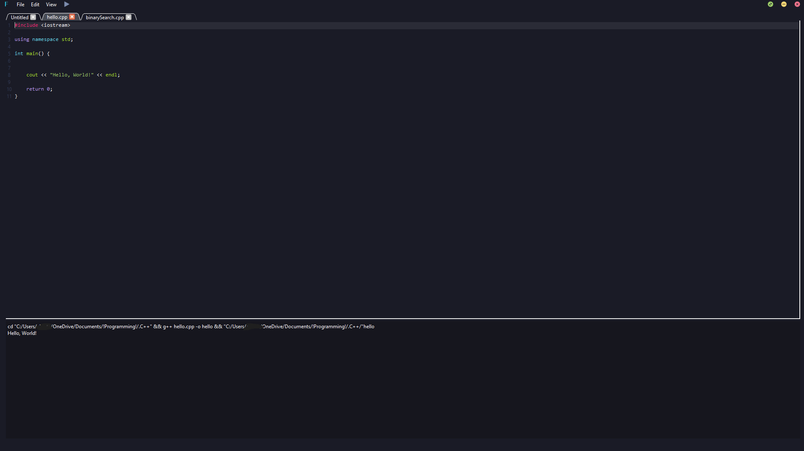
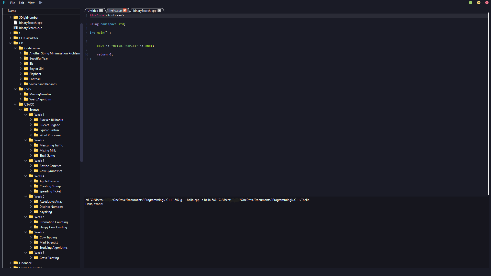

<p align="center">
Flow the text editor reimagined using C++ and the QT Framework
</p>

<div align="center">

  <a href=""></a>
  <a href=""></a>
  <a href=""></a>

</div>

<!--
[](https://choosealicense.com/licenses/mit/)
[](https://opensource.org/licenses/)
[](http://www.gnu.org/licenses/agpl-3.0)
-->

## Screenshots





## Features

- Can run/execute 5 different programming languages
- Dynamic syntax highlighting & language execution
- Built-in directory trees
- Changable font type & size


## Demo

https://user-images.githubusercontent.com/57378494/207727699-343550d9-a0f4-4b36-866a-e1b689c50418.mp4


## Installation


```
```
    
## Acknowledgements


## License
<!--
[MIT](https://choosealicense.com/licenses/mit/) -->


